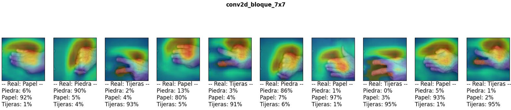
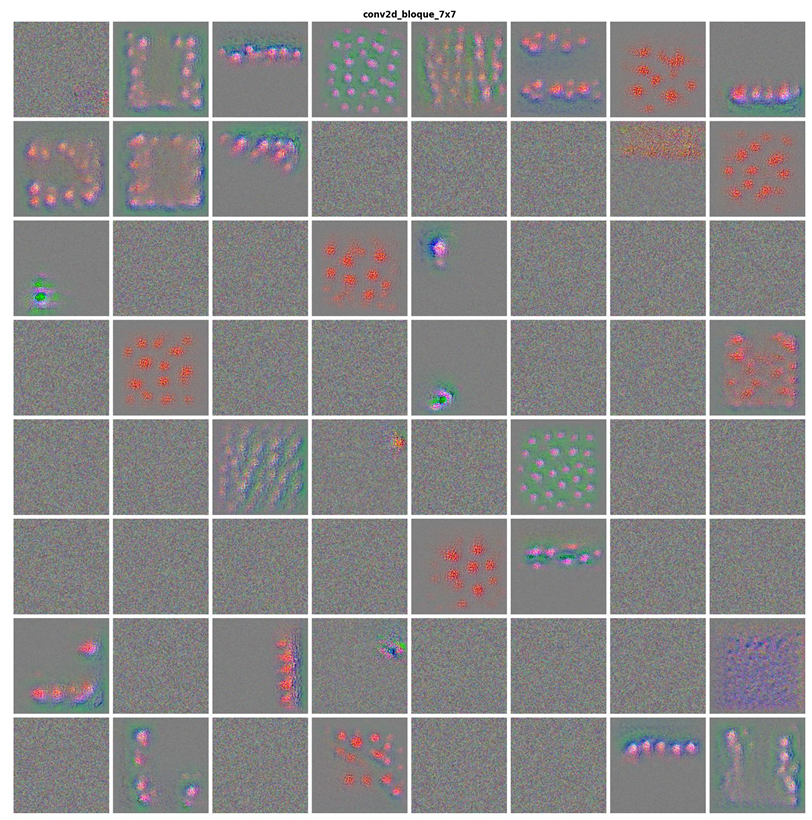

# 🧠 Image Recognition with Convolutional Neural Networks: Rock-Paper-Scissors 🪨✋✌️

This project uses **Deep Learning** techniques to classify hand gestures in the classic game of Rock-Paper-Scissors. With varying hand positions, orientations, and gesture styles, the challenge lies in creating robust models capable of accurate predictions.

---

## 📂 Dataset

The dataset is sourced from [Kaggle: Rock-Paper-Scissors Images](https://www.kaggle.com/datasets/drgfreeman/rockpaperscissors), containing thousands of labeled images. Data was split into:
- **Training (80%)**
- **Validation (6%)**
- **Testing (14%)**

---

## 🎯 Objective

To design, implement, and evaluate models capable of classifying images into one of the three categories:
- ✊ **Rock**
- ✋ **Paper**
- ✌️ **Scissors**

The study explores:
- The effectiveness of **Transfer Learning** (VGG16 and ResNet architectures).
- Building a **custom CNN** from scratch, both with and without **Ridge regularization**.
- Techniques like **data augmentation**, **fine-tuning**, and **kernel visualization**.

---

## ⚙️ Approach

### 🔄 Transfer Learning
1. **VGG16 and ResNet** were pretrained on ImageNet and fine-tuned for this dataset.
2. The architecture included frozen layers, dropout regularization, and task-specific dense layers.

### 🛠️ Custom Models
- A CNN inspired by Inception, analyzing images at two scales using convolutional layers with **7x7** and **3x3** filters.
- Ridge regularization was applied to combat overfitting and gradient vanishing issues.

---

## 🌟 Results

### Performance Metrics
- **Custom Model (with Ridge)**: Achieved **100% accuracy** on the test set.
- **VGG16 (Transfer Learning)**: High accuracy with notable misclassifications in "Paper" gestures.

### Visual Insights
#### Heatmaps:
- Correct classifications focused on hand contours.
- Misclassifications were often due to incomplete hands or unconventional gestures.

#### Kernel Activations:
- The VGG16 kernels retained texture-detection biases from ImageNet, emphasizing the need for fine-tuning.
- Custom models demonstrated effective edge and shadow detection.

